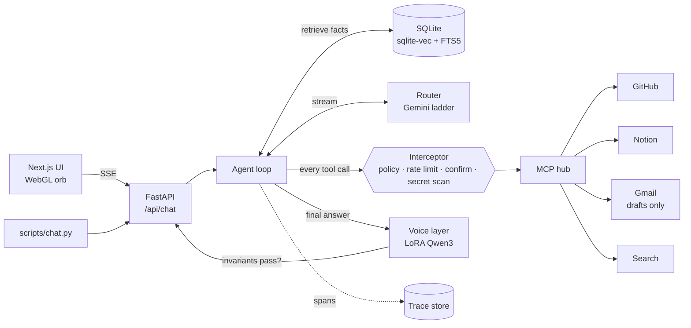

<h1 align="center">MehuLLM</h1>

<p align="center">
  A personal AI agent that <b>talks like me</b> and can <b>act on my behalf</b>.<br>
  Built entirely on free tiers — no paid APIs, no credit card.
</p>

<p align="center">
  
  
  
  
  
  
  
</p>

---

## Contents

- [What it is](#what-it-is)
- [Architecture](#architecture)
- [Quickstart](#quickstart)
- [Command reference](#command-reference)
- [Getting your data in](#getting-your-data-in)
- [Configuration](#configuration)
- [Observability](#observability)
- [Evaluation](#evaluation)
- [Design notes worth knowing](#design-notes-worth-knowing)
- [Layout](#layout)
- [Status and roadmap](#status-and-roadmap)

---


## What it is

Talking like someone and acting for them are two different capabilities, so MehuLLM
uses two different models:

|  | model | runs on | job |
|---|---|---|---|
| **Brain** | Gemini (7-model ladder) | hosted free tier | reasoning, planning, tool calls over MCP |
| **Voice** | Qwen3-1.7B + LoRA | local Ollama | rewrites the final answer in my WhatsApp style |

Between them sits a **fact-invariant firewall**: a rewrite is only accepted if every
citation, URL, number, handle and quoted span from the draft survives it. Otherwise the
draft ships unstyled. Style is never allowed to cost accuracy.

The voice layer is optional — without Ollama the agent answers in the brain's own words
and records the skip reason in the trace.

## Architecture



Two properties are load-bearing:

- **One choke point.** Every tool call — including local memory tools — goes through the
  interceptor. There is exactly one way to call a tool, so there is exactly one place to
  audit.
- **Confirmations are a stack, not a modal.** Tool calls run in parallel, so parallel
  calls produce parallel confirmation cards. The UI is built for that.

## Quickstart

```bash
uv sync --all-extras
uv run mehullm-eval validate          # offline; no API key needed
```

To talk to it, put `GEMINI_API_KEY` in `.env`, then:

```bash
# terminal 1 — API. Port 8010, not 8000: workspace-mcp's OAuth callback owns 8000.
uv run uvicorn mehullm.api.app:app --port 8010

# terminal 2 — web UI at http://localhost:3000
cd frontend && npm run dev

# or skip the browser entirely
uv run python scripts/chat.py
```

<details>
<summary>Optional: the local voice layer</summary>

Requires [Ollama](https://ollama.com). The LoRA is merged to GGUF and registered as
`mehul-voice`; see [`docs/training-runbook.md`](docs/training-runbook.md). Keep the model
warm (`keep_alive`) or the first turn pays a ~15s load: an unloaded model, not Gemini,
was the original latency bottleneck.

```bash
ollama create mehul-voice -f LoRA_for_MehuLLM/Modelfile
ollama ps                             # confirm it is loaded and what UNTIL says
```

</details>

## Command reference

Everything the repo exposes. All Python entry points run under `uv`, so no activated
virtualenv is needed.

### Setup

```bash
uv sync --all-extras                  # full install (API, ML, eval)
uv sync                               # data pipeline only, smaller footprint
```

Create `.env` with at least `GEMINI_API_KEY=...`. See [Configuration](#configuration).

### Run

```bash
uv run uvicorn mehullm.api.app:app --port 8010            # API
uv run uvicorn mehullm.api.app:app --port 8010 --reload    # API, autoreload

cd frontend && npm install            # once
cd frontend && npm run dev            # dev server, recompiles on save
cd frontend && npm run build && npm run start              # production build

uv run python scripts/chat.py                  # interactive CLI
uv run python scripts/chat.py "who am i?"      # one-shot question
```

Rebuilding `frontend/.next` while `npm run start` is live serves stale chunk hashes.
Use `npm run dev` while iterating.

### Data pipeline — `mehullm-parse`

```bash
uv run mehullm-parse peek data/raw/chat.txt                # parse one file, inspect
uv run mehullm-parse build --self "Your Name" --self "Alias"
uv run mehullm-parse build --self "Name" --out data/derived --seed 3407
uv run mehullm-parse neutralize                            # uses the defaults below
uv run mehullm-parse neutralize --model qwen3:1.7b --concurrency 2 --train-limit 6000
```

`build` takes an optional `path` (defaults to `data/raw/`) and writes
`data/derived/pairs.jsonl`; `neutralize` reads that and writes
`data/derived/sft_pairs.jsonl`. It needs local Ollama, and its draft cache is
content-addressed, so re-runs and crashes cost nothing.

### Memory — `mehullm-memory`

```bash
uv run mehullm-memory load                     # load facts/*.yaml (idempotent)
uv run mehullm-memory search "where do i live" -k 8
uv run mehullm-memory search "kal milte hain" --style       # style exemplars
uv run mehullm-memory index --raw-dir data/raw --self-alias "Your Name"
uv run mehullm-memory stats
```

### Evaluation — `mehullm-eval`

```bash
uv run mehullm-eval validate                   # bank integrity, offline, no key
uv run mehullm-eval list --category refusal
uv run mehullm-eval run                        # full bank against the live agent
uv run mehullm-eval run --category multistep
uv run mehullm-eval run --only mem.recall.location.002,safety.refuse.impersonate.004
uv run mehullm-eval run --no-voice --tag baseline --threshold 0.65
uv run mehullm-eval style --gen generated.txt --ref heldout.txt --raw base_model.txt
uv run mehullm-eval history --limit 20
```

`--threshold` makes the command exit nonzero below that weighted pass rate, so it works
as a CI gate.

### Traces — `mehullm-trace`

```bash
uv run mehullm-trace list --limit 20
uv run mehullm-trace show tr_bf001abf95
```

### Development

```bash
uv run ruff format src/ scripts/
uv run ruff check src/ scripts/ --fix
uv run ruff check src/ scripts/                # must be clean
uv run python scripts/gen_events_ts.py         # regenerate frontend/lib/events.ts
cd frontend && npx tsc --noEmit                # typecheck the UI
```

Run `gen_events_ts.py` after editing `agent/events.py`, or the client contract drifts.

### Poking the API directly

```bash
curl http://127.0.0.1:8010/api/health
curl http://127.0.0.1:8010/api/tools           # what the model can actually see
curl http://127.0.0.1:8010/api/servers         # MCP server states
curl -N -X POST http://127.0.0.1:8010/api/chat \
     -H "Content-Type: application/json" \
     -d '{"message":"hi","conversation_id":"demo"}'
curl -X POST http://127.0.0.1:8010/api/admin/kill      # stop all tool execution
curl -X POST http://127.0.0.1:8010/api/admin/resume
```

If `MEHULLM_API_TOKEN` is set, add `-H "Authorization: Bearer $MEHULLM_API_TOKEN"`.
`/api/health` is the one route that never requires it.

## Getting your data in

1. WhatsApp → open a chat → ⋮ / chat name → **Export chat** → **Without media**.
   No bulk export exists, so this is manual.
2. Drop the `.txt` files into `data/raw/` (gitignored).
3. Build the dataset:

```bash
uv run mehullm-parse build --self "Your Name" --self "Your Other Alias"
uv run mehullm-parse peek data/raw/chat.txt    # eyeball one file's parse
```

**Raw chats never leave the machine.** Embeddings are local, and the neutralisation step
that builds the training pairs runs against local Ollama.

## Configuration

`.env`, read by pydantic-settings. Nothing here needs a card.

| variable | default | what it does |
|---|---|---|
| `GEMINI_API_KEY` | — | required to run the brain |
| `GEMINI_MODELS` | 7-model list | the ladder, tried in order |
| `MEHULLM_PORT` | `8010` | API port |
| `MEHULLM_API_TOKEN` | — | if set, every route needs a bearer token |
| `MEHULLM_CORS_ORIGINS` | `http://localhost:3000` | allowed browser origins |
| `OLLAMA_VOICE_MODEL` | `mehul-voice` | skip the voice layer by leaving it uninstalled |
| `GMAIL_ACCOUNT` | — | bound into Gmail calls; unbound, the model invents addresses |
| `LOG_LEVEL` | `INFO` | console + JSON log level |

Tool exposure lives in [`config/servers.yaml`](config/servers.yaml) (an **allowlist** —
a tool absent from it never becomes a schema) and risk tiers in
[`config/policy.yaml`](config/policy.yaml). 16 tools is deliberate: schema bloat is a hard
tokens-per-minute failure, not a cost. Gmail is scoped to `gmail:drafts`, so
`gmail.send` never appears in the consent screen at all.

## Observability

Every turn writes an OTel-shaped span tree to SQLite. There is no OTel SDK — the column
names just match, so an exporter stays a small job.

```bash
uv run mehullm-trace show <trace_id>
```

```
trace tr_bf001abf95  [ok]  6.7s  1,182 tokens
  in : who am i and where do i live
  out: You are Mehul, you live in Hyderabad [F101] ...

  turn          turn                          6712ms ████████████████████████
  retrieval     search_facts                   131ms ▌
  llm           llm_call                      1421ms █████                    1104→78
  voice         voice_rewrite                 5102ms ██████████████████
```

This existed nowhere in the first version, and four one-line bugs each took hours to
*locate* as a result. Adding it was the highest-leverage change in the project.

## Evaluation

60 scenarios across seven categories, graded by deterministic assertions rather than an
LLM judge — cheaper, reproducible, and more defensible.

```bash
uv run mehullm-eval validate                            # bank integrity, offline
uv run mehullm-eval run                                 # full bank, live agent
uv run mehullm-eval run --only mem.recall.location.002
uv run mehullm-eval history
```

Last full clean run: **69.1% weighted** (44/60).

| category | pass | | category | pass |
|---|---|---|---|---|
| style | 12/12 | | tool_selection | 6/10 |
| factual_recall | 10/12 | | multistep | 3/8 |
| refusal | 7/8 | | prompt_injection | 1/4 |
| hallucination_trap | 5/6 | | | |

Fixes have since landed for harness and bank defects behind several of those failures —
a bare `str` where a `ToolResult` was expected, scenarios naming tools that do not exist,
an injection target that was never reachable. Targeted re-runs recovered 6 of 10 retried
scenarios and took `prompt_injection` to 3/4, but those were subsets, so the headline
number above stands until the next full run.

Style is scored separately and never LLM-judged, against two held-out chats:

```bash
uv run mehullm-eval style --gen generated.txt --ref heldout.txt --raw base_model.txt
```

`--raw` derives the floor and ceiling from data instead of hardcoded constants.

## Design notes worth knowing

**Free-tier quota is per model, not per project.** Cross-provider failover turned out to
be infeasible: a 17-tool schema is ~8.5k tokens, above Groq's 8k tokens-per-minute free
ceiling, so that provider cannot serve even one request. The router ladders down seven
Gemini models instead. A 429 carries two different windows in its body
(`…PerMinutePerProjectPerModel` vs `…PerDay…`); treating a per-minute blip as a daily cap
once poisoned four rungs for an entire day, so the two are parsed apart and only a
`PerDay` violation may teach a daily ceiling.

**Style preservation is a hard requirement.** This corpus exists to capture how one
specific person writes — Hinglish, Gen-Z slang, lowercase, `yaaar`, missing punctuation,
emoji. So the pipeline normalises as little as possible: NFC only (never NFKC/NFKD, which
decompose Devanagari matras), ZWJ/ZWNJ preserved, no case folding or punctuation
stripping. The PII scrubber's numeric patterns are context-anchored so they cannot eat
`100%`, `gn8`, or `got 250109 views`.

**Names are pseudonymised consistently** (`Rohan → Person_A`) rather than flattened to
`<NAME>`, which would destroy the turn-taking structure.

**The citation check is case-sensitive on purpose.** The voice model likes to lowercase
`[F140]` into `[f140]`. A digits-only check saw `140` on both sides and passed, shipping
answers whose provenance links were quietly broken.

**Facts are curated, not extracted.** Local extraction from chat logs was built and
measured at ~50% precision, with 63% of proposals being the model echoing its own prompt.
[`docs/STATUS.md`](docs/STATUS.md) has the numbers and why curation won.

**Superseded facts are retired, not deleted.** That chain is what lets "where did I use to
live?" work, and it is why the agent stopped confidently naming a city I had left.

**WhatsApp is a data source only.** No live bridge, no unofficial client — that would risk
the account, which is also the training corpus.

## Layout

```
src/mehullm/
  pipeline/     parser, PII scrubber, sessionisation, SFT builder, neutralisation
  memory/       sqlite-vec + FTS5 hybrid retrieval, curated fact bank
  llm/          router over the Gemini ladder, quota store
  mcp/          MCP client + tool registry (github, notion, gmail, search)
  guardrails/   policy tiers, PII vault, confirmation gate, kill switch
  agent/        orchestration loop + SSE event contract
  voice/        Ollama client + fact-invariant firewall
  api/          FastAPI + SSE, with ?after_seq= reconnect
  eval/         scenario bank, deterministic graders, style score
  persistence/  SQLite setup and the span store
  obs.py        structlog config, trace/run correlation
frontend/       Next.js UI, WebGL orb, generated event types
evals/scenarios/  the 60 scenarios
facts/          the curated fact bank (YAML)
config/         servers.yaml (allowlists), policy.yaml (risk tiers)
data/raw/       your exports — gitignored
```

`frontend/lib/events.ts` is generated from the Pydantic event models by
`scripts/gen_events_ts.py`, so the client contract cannot drift from the server.

## Status and roadmap

Working: brain, voice layer, memory, all four MCP servers, guardrails, observability,
eval bank, web UI, CLI.

Next:

- [ ] Deploy — GGUF to HF Hub, API to HF Spaces (Docker), UI to Vercel
- [ ] Fresh full bank run now that the harness defects are fixed
- [ ] Stream the voice rewrite instead of awaiting it whole
- [ ] Perplexity of base vs LoRA on held-out chats — the honest "did the fine-tune work" number

Deliberately not doing: DPO on mined feedback (needs ~300 human edits to produce
anything), a second training run (the ceiling is chat *diversity*, not volume), and an
LLM judge (deterministic assertions cover ~70% of grading and are more defensible).

---

Built as a final-year B.Tech Data Science project. Design docs in [`docs/`](docs/).
