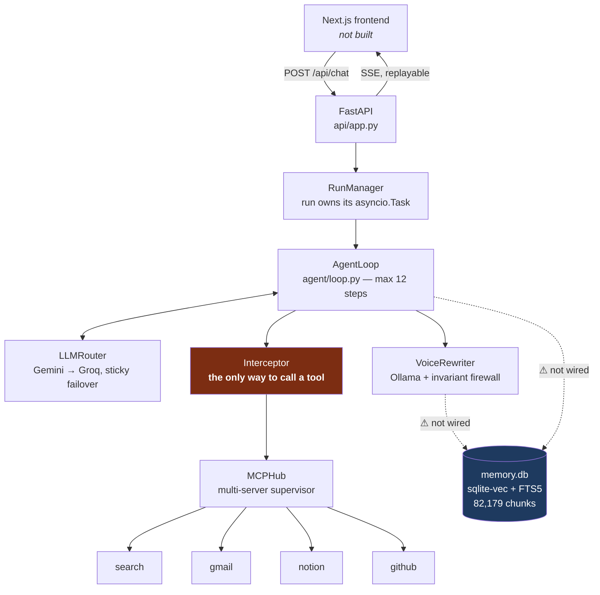
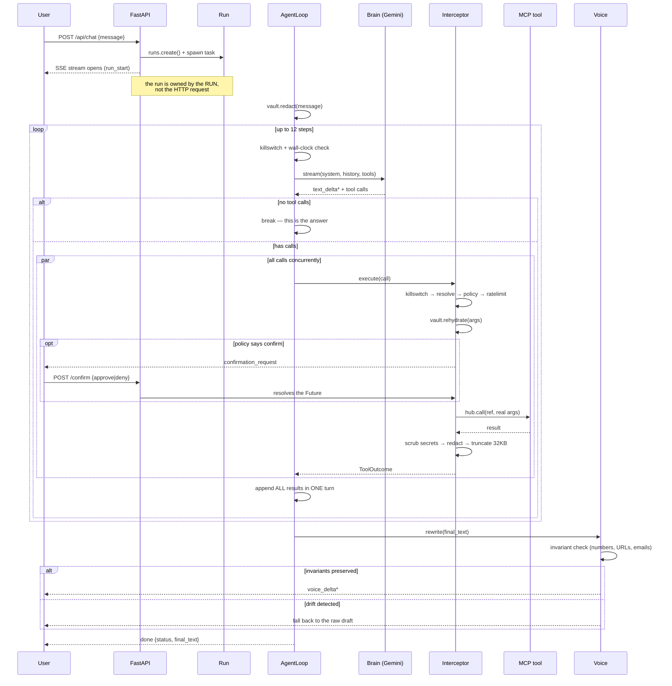
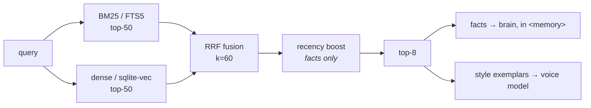

# Architecture

What the code does today — not the plan. Gaps are marked ⚠ and listed at the end.

## Components



The **Interceptor** is the choke point. There is no second path to a tool, which
is what makes the guardrails a property of the system rather than a convention.

## A turn, end to end



### Why it is shaped this way

**The run outlives the request.** `POST /api/chat` creates the `Run`, spawns its
task, and returns a stream that is merely *a subscriber*. Close the browser and
the loop keeps going; reconnect with `?after_seq=N` and the ring buffer replays
everything missed. This exists for one reason: a confirmation card can sit
unanswered for minutes, and the decision arrives on a **different HTTP request**
while the loop is parked on an `asyncio.Future`.

**All tool results go back in one turn.** Splitting them teaches the model to
stop making parallel calls. Every call gets a result — including denied and
errored ones — or the provider rejects the history as malformed.

**Confirmations are a stack, not a modal.** The loop dispatches calls with
`asyncio.gather`, so three T2 calls produce three concurrent cards.

**PII crosses the boundary twice.** The hosted model only ever sees
`⟦PII_EMAIL_3⟧`; the interceptor rehydrates the real value immediately before
dispatch, so the tool gets what it needs and Gemini never does. Confirmation
cards show rehydrated values — reviewing a placeholder would be pointless.

## Guardrail order

Fixed, and the order is the design:

```
killswitch → resolve name → policy → rate limit → rehydrate
           → confirm? → dispatch → secret scan → redact → truncate
```

`default_action: confirm` means a newly added server's unclassified tools
*prompt* rather than fire. Provenance escalation: once a turn has touched web
search, later T1/T2 calls escalate to confirm — a poisoned search result can
suggest sending an email but cannot cause one silently.

## Memory



Facts and style exemplars feed **different prompts and never mix** — style
exemplars in the brain's context produce an agent that answers in fragments.

## ⚠ Built but not wired

These import cleanly and are dead at runtime. All are small to connect:

| What | Consequence today | Fix |
|---|---|---|
| **Memory retrieval** | `run_turn(run, msg)` leaves `memory_facts=""`, so `<memory>` is always empty and the agent knows nothing about you | call `search_facts` in `/api/chat`, pass the rendered block |
| **Local tools** | `tools/local.register()` is never called, so `local__memory_search`, `local__remember`, `local__now` don't exist at runtime | call it in `startup()`, pass `local_tools` to the Interceptor |
| **Tracing** | `persistence/tracing.py` has zero importers; no spans are recorded | wrap the loop's LLM/tool/voice calls |
| **Conversation history** | `Run.history` starts empty every turn — the agent has no short-term memory across turns | load prior turns by `conversation_id` on create |
| **Judge** | `BankRunner(judge=None)`; eval runs are assertion-only | construct `Judge(client)` in the eval CLI |

The first two are what stand between "a chatbot with tools" and "a personal
agent". They are the natural next step after the question bank exists, because
until there are facts to retrieve, wiring retrieval has nothing to return.

## Data pipeline (offline, already run)

```
data/raw/*.txt
  → whatsapp_parser   two-stage; preserves style verbatim
  → pii               scrub + consistent pseudonyms
  → sessionize        180s burst merge, 6h session split
  → build_sft         bucket caps, split BY CHAT
  → pairs.jsonl       75,465 pairs
  → neutralize        local Ollama → rewriter input side (A/B variants)
  → index_chats       → memory.db, 82,179 chunks
```

Runs entirely locally. Raw chats never leave the machine — the reason
neutralisation and indexing use Ollama rather than a hosted API.
